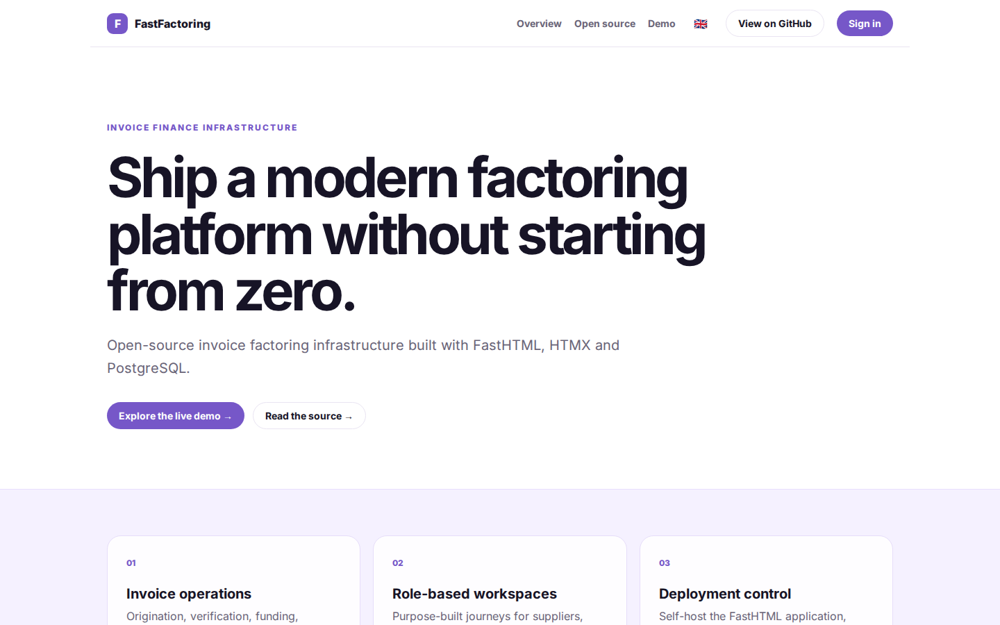
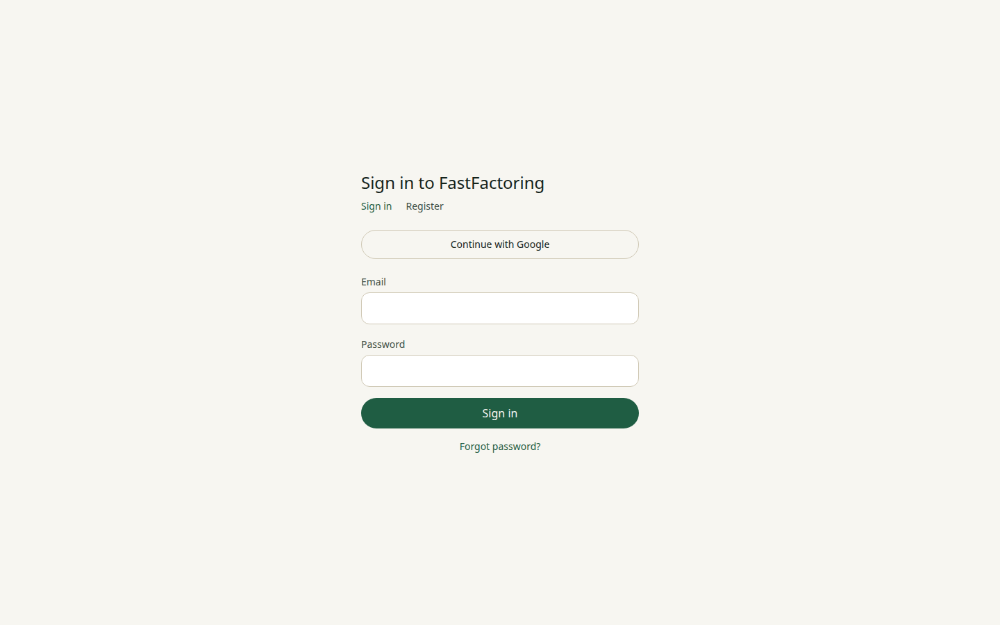

# FastFactoring Platform Guide

**Published:** 2026-08-19
**Platform:** [https://fastfactoring.org](https://fastfactoring.org)
**Source:** [github.com/predictivelabsai/FastFactoring](https://github.com/predictivelabsai/FastFactoring)

## Platform overview

**FastFactoring** is an open-source invoice-financing platform built with FastHTML, HTMX, and PostgreSQL. It gives product teams an auditable foundation for supplier onboarding, invoice verification, funding, servicing, collections, settlement, and role-specific operations without a proprietary JavaScript application s

This visual guide was reviewed against the live product using Playwright. Screens and available navigation can vary by account, role, and deployment configuration.

## 1. Ship a modern factoring platform without starting from zero.

INVOICE FINANCE INFRASTRUCTURE Ship a modern factoring platform without starting from zero. Open-source invoice factoring infrastructure built with FastHTML, HTMX and PostgreSQL. Explore the live demo → Read the source → 01 Invoice operations Origination, veri

Screen reviewed at: [https://fastfactoring.org/](https://fastfactoring.org/)

## 2. Sign in to FastFactoring

Sign in to FastFactoring Sign in Register Continue with Google Email Password Sign in Forgot password?

Screen reviewed at: [https://fastfactoring.org/login](https://fastfactoring.org/login)

## 3. Ship a modern factoring platform without starting from zero.

INVOICE FINANCE INFRASTRUCTURE Ship a modern factoring platform without starting from zero. Open-source invoice factoring infrastructure built with FastHTML, HTMX and PostgreSQL. Explore the live demo → Read the source → 01 Invoice operations Origination, veri

Screen reviewed at: [https://fastfactoring.org/fastfactoring](https://fastfactoring.org/fastfactoring)

## 4. Ship a modern factoring platform without starting from zero.

INVOICE FINANCE INFRASTRUCTURE Ship a modern factoring platform without starting from zero. Open-source invoice factoring infrastructure built with FastHTML, HTMX and PostgreSQL. Explore the live demo → Read the source → 01 Invoice operations Origination, veri

Screen reviewed at: [https://fastfactoring.org/fastfactoring](https://fastfactoring.org/fastfactoring)

## Getting started

Visit [https://fastfactoring.org](https://fastfactoring.org) to explore FastFactoring. For source code and deployment details, use the GitHub link above.
